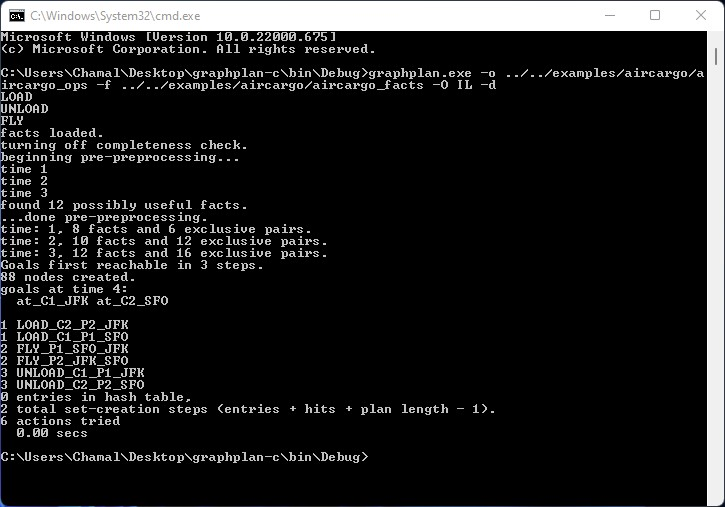

## Graphplan Algorithm ##

<br>

This is the original work of  Avrim Blum, Merrick Furst, John Langford took it from https://www.cs.cmu.edu/~avrim/graphplan.html.

I made it work with the latest gcc (i686-w64-mingw32) compiler 

<hr>

### Run the pre-build Microsoft Windows 10/11 (32bit/64bit) binary ###

* Git clone or download the code
```
git clone https://github.com/Wickramanayaka/graphplan-c.git
```

* Using your favorite terminal (DOS or Git Bash or Powershell) change directory into graphplan-c/bin/Debug
```
$ cd bin/Debug
```
* If you are using DOS (cmd.exe) command prompt, copy and paste below command line into the terminal and hit Enter key.
```
graphplan.exe -o ../../examples/aircargo/aircargo_ops -f ../../examples/aircargo/aircargo_facts -O IL -d
```
* If you are using git-bash or Powershell terminal, copy and paste below command line into the terminal and hit Enter key.
```
./graphplan.exe -o ../../examples/aircargo/aircargo_ops -f ../../examples/aircargo/aircargo_facts -O IL -d
```
<hr>

### Build from the source ###

* The original code was written in 1997 and I used the following compiler provided by <a href="https://www.codeblocks.org/downloads/binaries/">Code Blocks </a> the well-known C/C++ IDE to build the application.
* Download the <a href='https://www.fosshub.com/Code-Blocks.html?dwl=codeblocks-20.03-32bit-mingw-32bit-setup.exe'>``` codeblocks-20.03-32bit-mingw-32bit-setup.exe ```</a> exact version from the link below.
```
https://www.fosshub.com/Code-Blocks.html?dwl=codeblocks-20.03-32bit-mingw-32bit-setup.exe
```
* This Code Blocks setup has mingw-32bit compiler.
* The Code Blocks installation is straight forward.
* Once the installation is done make sure to setup compiler for Code Blocks by follwing few steps bellow.
* Run Code Blocks
* Then navigate to <b> Settings -> Compiler... -> Toolchain executables</b>


* Change followings according to your Code Blocks installation.

> Compiler's Installation Directory : ``` C:\Program Files (x86)\CodeBlocks\MinGW\bin ```

> C compiler : ``` C:\Program Files (x86)\CodeBlocks\MinGW\bin\i686-w64-mingw32-gcc.exe ```

> C++ compiler : ``` C:\Program Files (x86)\CodeBlocks\MinGW\bin\i686-w64-mingw32-g++.exe ```

> Linker for dynamic libs : ``` C:\Program Files (x86)\CodeBlocks\MinGW\bin\i686-w64-mingw32-g++.exe ```

* To open the projec click on <b>Open an existing project</b> link on the middle of Code Blocks window.
* Browse the ``` graphplan-c ``` folder (This is the folder you have cloned or downloaded and extracted previously) in your pc and select ``` graphplan.cbp ``` and open it
* Navigate to ``` Build -> Build and run ```
* Once the build process has completed the application will be loaded there you can provide *_ops and *_facts files and few more parameters to the application then the application will output the result.

<hr>

### Running the examples ###
With this Github page I have added two most famous example one is <b>Air Cargo Transport World</b> (taught in MSc. Data Science and AI, University of Sri Jayewardenepura by Dr. Ananda Dehigaspitiya). The other one is <b> Rocket World </b> from the original work.

To run the each world navigate into the ``` graphplan-c\bin\Debug ``` folder using  a terminal

<br>

#### Run Air Cargo Transport ####

``` graphplan.exe -o ../../examples/aircargo/aircargo_ops -f ../../examples/aircargo/aircargo_facts -O IL -d ```



Note: Make sure to add <b>' ./ '</b> if you are using git-bash or Powershell.

<br>

#### Run Rocket world ####

``` graphplan.exe -o ../../examples/rocket/rocket_ops -f ../../examples/rocket/rocket_facts -O IL -d ```

<hr>

### How to create your own world ###